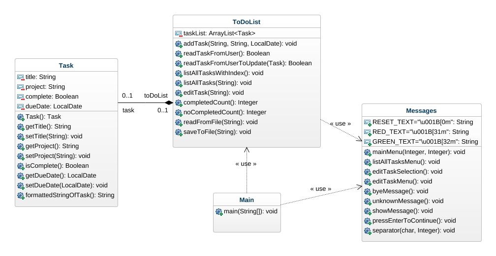
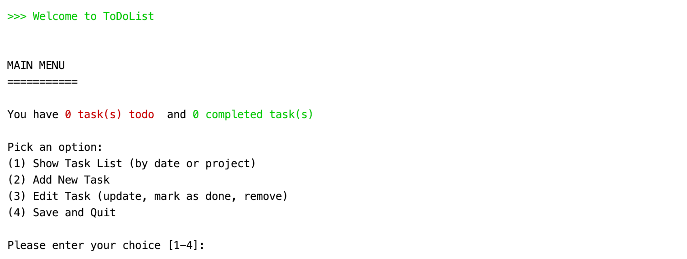
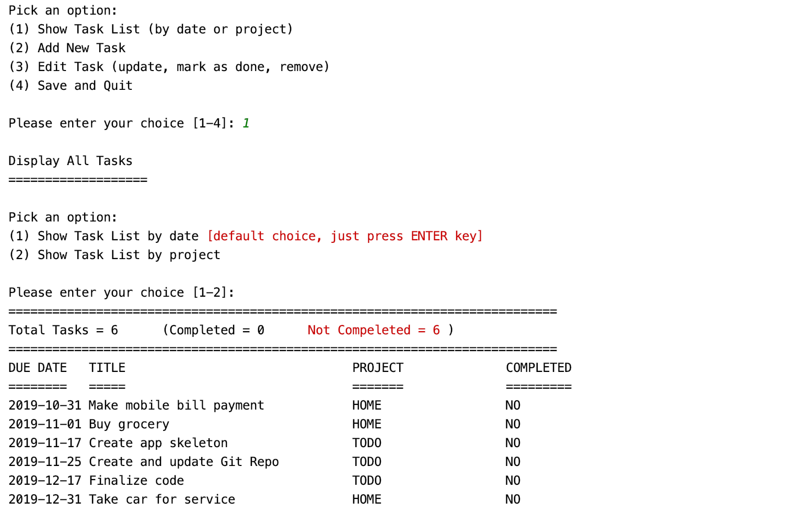
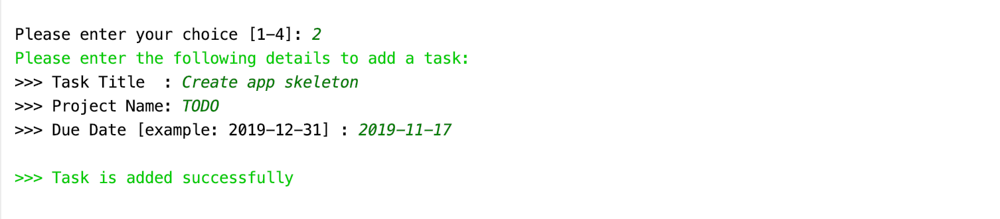
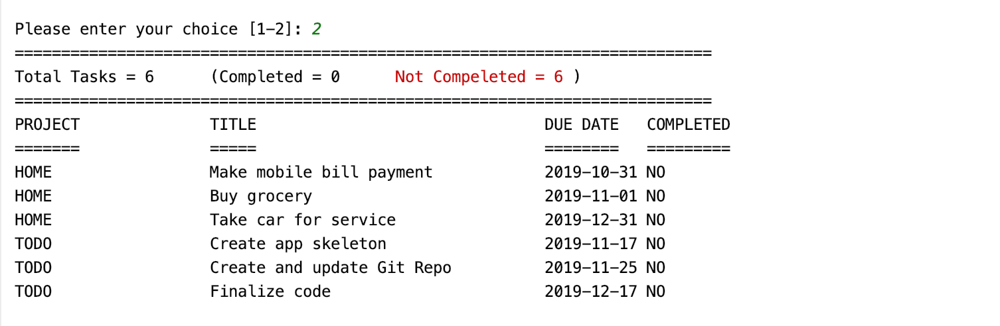
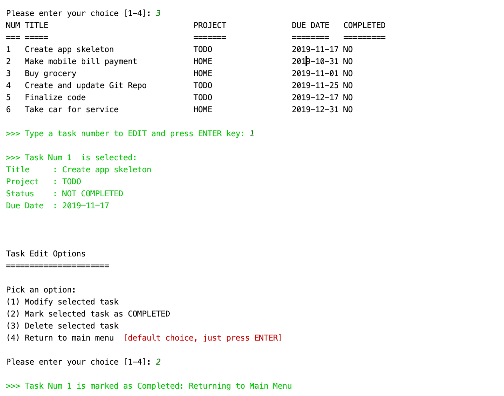
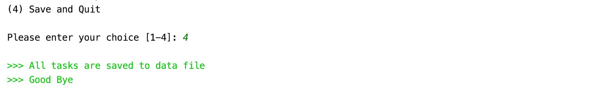

## todo-list: A command line application in JAVA
A simple command line JAVA program to create and manage a personal Todo List. 

#### A brief overview:
This program is menu-driven. User will be presented with available options corresponding to selected menu.
User will select an option from given choices and press ENTER key to move to next step.
This program will save all tasks in the data file, therefore, next time when you open the program, it will resume its state.

#### Basic features
* Models a task with: 
    * task title
    * due date
    * completion status
    * project (if any)
* Display a collection of tasks that can be sorted
    * by date
    * by project
* Support the ability to
    * add task
    * edit task
    * mark a task as done
    * remove (delete) tasks
* Support a text-based user interface
* Load and save task list to data file

## Class Diagram

## User Manual
#### Starting the application
When user will run the program,  main menu of the program (as shown below) will be shown to the user:

#### Display list of tasks
If user types number [1] and press ENTER key, the application will
display the options for user to get list of all previously added tasks
sorted by date or by project.

#### Add a new task
If user types number [2] and press ENTER key, the application will
prompt the user to enter the required fields of a task to add in the 
task list.

#### Edit an existing task (update, mark as done, remove)
If user types number [3] and press ENTER key, the application will
display the list of all previously saved tasks with index number and 
user has to select a task to perform any update, to mark as done or to remove.

#### Closing the application
If user types number [4] and press ENTER key, the application will save 
data of all tasks from memory and write to the data file on disk (defaut filename is `tasks.obj`).

